# Thesis Development Steps: Structural and Functional Brain Map Analysis

**Author:** Luís Araújo  
**Title:** Structural and Functional Analysis of Brain Maps in Alzheimer's Disease  
**Last Updated:** December 2025

This document describes the chronological development steps of the thesis project, including code references and commands used throughout the analysis pipeline.

---

## Overview

This thesis analyzes structural MRI data from the NACC dataset (833 post-mortem cases) to identify brain regions affected in Alzheimer's Disease (AD) compared to Primary Age-Related Tauopathy (PART), and Neocortical Lewy Body (LB) pathology. Findings are correlated with molecular brain maps using spatial permutation testing.

**Main Pipeline:**
```
┌─────────────┐    ┌──────────────┐    ┌─────────────────┐    ┌──────────────┐
│  Raw MRI    │───►│  Filtering   │───►│ FreeSurfer      │───►│   Group      │
│             │    │  (T1 only)   │    │ recon-all       │    │   Analysis   │
└─────────────┘    └──────────────┘    │ + qcache        │    │   (GLM)      │
                                       └─────────────────┘    └──────┬───────┘
                                                                     │
                                                                     ▼
┌─────────────┐    ┌──────────────┐    ┌─────────────────┐    ┌──────────────┐
│   NCT       │◄───│  Neuromaps   │◄───│   Export to     │◄───│  Cluster     │
│  (Network   │    │  (Spatial    │    │   GIFTI/fsa6    │    │  Correction  │
│   Mapping)  │    │  Correlation)│    │                 │    │  Monte Carlo │
└─────────────┘    └──────────────┘    └─────────────────┘    └──────────────┘

Outputs:
- Group Analysis: gamma.mgh (effect size), sig.mgh (uncorrected significance)
- Cluster Correction: *.cluster.mgh (cluster-corrected map)
```




```mermaid
flowchart TD
    A[🧠 Raw MRI] --> B[📁 Filtering<br/>T1 only]
    B --> C[❄️ FreeSurfer<br/>recon-all + qcache]
    C --> D[📊 Group Analysis<br/>GLM]
    
    D --> E[gamma.mgh<br/>effect size]
    D --> F[Cluster Correction<br/>Monte Carlo - sig.mgh]
    
    E --> G[Export to GIFTI]
    F --> H[Export to fsaverage6]
    
    G --> I[🗺️ Neuromaps<br/>Spatial Correlation]
    H --> J[🔗 NCT<br/>Network Mapping]
    
    style A fill:#e0e0e0,stroke:#333,color:#000
    style B fill:#e0e0e0,stroke:#333,color:#000
    style C fill:#a5d6a7,stroke:#2e7d32,color:#000
    style D fill:#a5d6a7,stroke:#2e7d32,color:#000
    style E fill:#bbdefb,stroke:#1565c0,color:#000
    style F fill:#ffcdd2,stroke:#c62828,color:#000
    style G fill:#bbdefb,stroke:#1565c0,color:#000
    style H fill:#ffcdd2,stroke:#c62828,color:#000
    style I fill:#64b5f6,stroke:#1565c0,color:#000
    style J fill:#e57373,stroke:#c62828,color:#000
```

**Figure 1:** Project Workflow Illustration. FreeSurfer Processing Data pipeline (Green) was retrieved and adapted from Gao et al. (2020). Neuromaps Workflow (Blue) was retrieved from Markello et al. (2022). Network Correspondence Toolbox Workflow (Red) was retrieved from Kong et al. (2025).

---

## Phase 0: Initial Development (Proof of Concept)

### 0.1 MNI-152 Normalization Script

**Script:** `Utils/niftiTOmni152.py`

Early in development, this script was created to normalize NIfTI volumes to MNI-152 space for testing the Neuromaps pipeline with volumetric data.

```python
from nilearn.image import resample_to_img
from nilearn.datasets import load_mni152_template

template = load_mni152_template(resolution=2)
normalized = resample_to_img(source_img, template)
```

**Note:** This was used for proof-of-concept testing before the FreeSurfer surface-based pipeline was implemented.

---

## Phase 1: Data Acquisition and Preprocessing

### 1.1 Automated MRI Data Extraction

**Scripts:** `automated_filtering/`
- `process_MRIs.py` - Extract subjects from ZIP files
- `process_MRIs_modality.py` - Filter T1-weighted scans using JSON metadata
- `cross_MRIs.py` - Cross-reference with neuropathological data
- `process_MRIs_pipeline.sh` - Orchestration script

**Example command:**
```bash
./process_MRIs_pipeline.sh \
  -s /source/NACC_MRI_RawData/ \
  -d /dest/NACC_MRI_subjects/ \
  -c subjects.csv \
  -n subjects_final.csv \
  -m t1 \
  -t 'mprage,t1,3d_ir'
```

**What it does:** Extracts DICOM/NIfTI from archives, runs `dcm2niix` conversion, filters T1-weighted sequences, creates filtered subject list.

---

## Phase 2: FreeSurfer Cortical Reconstruction

### 2.1 Surface Reconstruction (recon-all)

**Example command (single subject):**
```bash
recon-all -i /path/to/scan.nii.gz -s NACC145249 -all -qcache
```

**Script:** `FreeSurfer/freesurfer_process.sh`

**Batch processing with GNU parallel:**
```bash
cat commands_file.txt | parallel --progress --jobs 12
```

**Parameters:**
- `-all`: Complete 31-step reconstruction pipeline
- `-qcache`: Pre-computes smoothed maps at 0, 5, 10, 15, 20, 25mm FWHM

**Quality Control:** Subjects with significant surface gaps were excluded (see thesis Table 9 for details).

**➤ Quality Control Visualization:**
```bash
# Check pial/white surface placement
freeview -v $SUBJECTS_DIR/NACC145249/mri/brainmask.mgz \
         -f $SUBJECTS_DIR/NACC145249/surf/lh.pial:edgecolor=red \
         -f $SUBJECTS_DIR/NACC145249/surf/lh.white:edgecolor=yellow \
         -f $SUBJECTS_DIR/NACC145249/surf/rh.pial:edgecolor=red \
         -f $SUBJECTS_DIR/NACC145249/surf/rh.white:edgecolor=yellow

# Check for surface gaps (remove subjects with significant gaps)
freeview -f $SUBJECTS_DIR/NACC145249/surf/lh.pial:overlay=$SUBJECTS_DIR/NACC145249/surf/lh.volume
```

### 2.2 Local Gyrification Index (LGI)

**Scripts:** 
- `FreeSurfer/localLGI.sh` - Compute LGI (after recon-all)
- `FreeSurfer/createLGI.sh` - Smooth and resample for group analysis

**Compute LGI:**
```bash
# Given a subject directory, it will compute the LGI for all sujects in parallel
./localLGI.sh
```

**Smooth and resample for group analysis:**
```bash
# Smooth LGI (FWHM=10mm)
mris_fwhm --s NACC145249 --hemi lh \
  --cortex --smooth-only --fwhm 10 \
  --i $SUBJECTS_DIR/NACC145249/surf/lh.pial_lgi \
  --o $SUBJECTS_DIR/NACC145249/surf/lh.pial_lgi.fwhm10.mgh

# Resample to fsaverage
mri_surf2surf --srcsubject NACC145249 \
  --srcsurfval surf/lh.pial_lgi.fwhm10.mgh \
  --trgsubject fsaverage \
  --trgsurfval surf/lh.pial_lgi.fwhm10.fsaverage.mgh \
  --hemi lh
```

**View LGI:**
```bash
freeview -f $SUBJECTS_DIR/NACC145249/surf/lh.pial:overlay=$SUBJECTS_DIR/NACC145249/surf/lh.pial_lgi
```

### 2.3 Brainstem AAN Segmentation

**Script:** `FreeSurfer/segmentAAN.sh` 

**Note:** Requires FreeSurfer 8.1.0 image - `freesurfer/freesurfer:8.1.0` (used Docker image for compatibility with v7.4.1)

**Script structure (parallel processing):**
```bash
# Set environment
SUBJECTS_DIR=/data
export ITK_GLOBAL_DEFAULT_NUMBER_OF_THREADS=12

# Get list of subjects
subjects=($(ls $SUBJECTS_DIR | grep "^NACC[0-9]*"))

# Run up to 12 subjects in parallel
max_jobs=12
job_count=0
for subject in "${subjects[@]}"; do
    echo "Processing subject: $subject"
    SegmentAAN.sh "$subject" &
    job_count=$((job_count+1))
    if (( job_count % max_jobs == 0 )); then
        wait
    fi
done
wait
```

**Script:** `extract_segmentAAN.sh`

Extracts created segmentation files from all subjects into a single folder.

**Note:** Regex may be updated given the name files of each subject.

**Outputs:** Brainstem nuclei volumes (VTA, LC, PTg, DR, MnR, etc.)

---

## Phase 3: Group-Level Statistical Analysis

**Note:** Used scripts where adapted from Andy's Brain Book - FreeSurfer Short Course

### 3.1 Prepare Group Data

**Script:** `FreeSurfer/runMrisPreproc.sh`

**Example command:**
```bash
# For thickness (uses qcache)
mris_preproc --fsgd FSGD/${study}.fsgd \
  --cache-in thickness.fwhm10.fsaverage \
  --target fsaverage \
  --hemi lh \
  --out lh.thickness.${study}.10.mgh

# For LGI (manually preprocessed with createLGI.sh)
mris_preproc --fsgd FSGD/${study}.fsgd \
  --cache-in pial_lgi.fwhm10.fsaverage \
  --target fsaverage \
  --hemi lh \
  --out lh.pial_lgi.${study}.10.mgh
```

### 3.2 General Linear Model (GLM)

**Script:** `FreeSurfer/runGLMs.sh`

**Example command:**
```bash
mri_glmfit \
  --y lh.thickness.${study}.10.mgh \
  --fsgd FSGD/${study}.fsgd doss \
  --C Contrasts/AD-PART_Age_Delta_eTIV.mtx \
  --C Contrasts/PART-AD_Age_Delta_eTIV.mtx \
  --surf fsaverage lh \
  --cortex \
  --glmdir lh.thickness.${study}.10.glmdir
```

**Outputs (from mri_glmfit):**
- `gamma.mgh` - Effect size (contrast estimate)
- `sig.mgh` - Uncorrected significance map

**Example of FSGD File Structure (covariates normalized 0-1):**
```
GroupDescriptorFile 1
Title AdvsPARTwithoutLBStudy_Age_Delta_eTIV_norm2
Class ADNC
Class PART
Variables  Age  Delta  eTIV
Input  NACC004099  ADNC  0.82  0.11  0.24
Input  NACC014139  PART  0.70  0.56  0.48
...
```

**Example of Contrast Matrix (tests AD > PART):**
```
# AD-PART_Age_Delta_eTIV.mtx
1 -1 0 0 0
```

**Note:** Sex covariate was removed from final models after preliminary testing showed models without it yielded more robust clusters.

### 3.3 Cluster-Wise Correction (Monte Carlo)

**Script:** `FreeSurfer/runClustSims.sh`

**Example command:**
```bash
mri_glmfit-sim \
  --glmdir lh.thickness.${study}.10.glmdir \
  --cache 1.3 pos \
  --cwp 0.05 \
  --2spaces
```

**Parameters (Standard):**
- `--cache 1.3 pos`: Vertex-wise threshold p < 0.05 (|t| > 1.3), positive effects
- `--cwp 0.05`: Cluster-wise p-value threshold
- `--2spaces`: Correct for both hemispheres

**Output (from mri_glmfit-sim):**
- `*.cluster.mgh` - Cluster-corrected significance map

**Example to View Results:**
```bash
# View significant clusters on inflated surface
freeview -f $SUBJECTS_DIR/fsaverage/surf/lh.inflated:overlay=lh.thickness.${study}.10.glmdir/AD-PART_Age_Delta_eTIV/cache.th13.pos.sig.cluster.mgh:overlay_threshold=1.3,5

# View effect sizes (gamma) from group analysis
freeview -f $SUBJECTS_DIR/fsaverage/surf/lh.inflated:overlay=lh.thickness.${study}.10.glmdir/AD-PART_Age_Delta_eTIV/gamma.mgh:overlay_threshold=0.05,0.3
```

**Note:** Run all scripts (3.1, 3.2, 3.3) with `FreeSurfer/runAllGroupScripts.sh`

**Example command:**
```bash
./runAllGroupScripts.sh AdvsPARTwithoutLBStudy
```

### 3.4 Export Regional Statistics

**Scripts:**
- `FreeSurfer/export_desikan_killiany.sh`
- `FreeSurfer/export_desikan_killiany_LGI.sh`

**Example commands:**
```bash
# Cortical measures (thickness, volume, area)
aparcstats2table --subjects $(cat subjects_list.txt) \
  --hemi lh --meas thickness --parc=aparc \
  --tablefile lh_thickness_aparc_study.txt

# Subcortical volumes
asegstats2table --subjects $(cat subjects_list.txt) \
  --meas volume --stats=aseg.stats \
  --tablefile aseg_volume_study.txt

# LGI per region (requires mri_segstats)
mri_segstats \
  --annot NACC145249 lh aparc \
  --i $SUBJECTS_DIR/NACC145249/surf/lh.pial_lgi \
  --sum ${OUTPUT_DIR}/NACC145249_lh.aparc.pial_lgi.stats
```

---

## Phase 4: Neuromaps Spatial Correlation Analysis

### 4.1 Convert FreeSurfer Outputs to GIFTI

**Export gamma (effect size) maps for Neuromaps:**
```bash
# Convert gamma.mgh to GIFTI (both hemispheres)
mri_convert lh.thickness.${study}.10.glmdir/AD-PART_Age_Delta_eTIV/gamma.mgh \
            lh.ADvsPART.thickness.gamma.gii

mri_convert rh.thickness.${study}.10.glmdir/AD-PART_Age_Delta_eTIV/gamma.mgh \
            rh.ADvsPART.thickness.gamma.gii
```

### 4.2 Surface-Based Correlation (Vertex-wise)

**Script:** `Neuromaps/pipeline_neuromaps_v5.py`

**Example command:**
```bash
python pipeline_neuromaps_v5.py \
  --source_path_left lh.ADvsPART.thickness.gamma.gii \
  --source_path_right rh.ADvsPART.thickness.gamma.gii \
  --source_space fsaverage \
  --target_source beliveau2017 \
  --target_desc cumi101 \
  --target_space fsaverage \
  --target_den 164k \
  --null_model vazquez_rodriguez \
  --n_perm 1000
```

**Null Model Selection:**
- Surface vertex-wise: `vazquez_rodriguez` (spin-test)
- Parcellated: `cornblath`
- Volumetric: `burt2020`

### 4.3 Parcellated Correlation (Region-based)

**Script:** `Neuromaps/neuromaps_multi_parcellation.py`

Similar command to the vertex-wise program and uses Desikan-Killiany atlas annotations from FreeSurfer.

**Note:** Maps with 4k or 32k vertices were excluded (incompatible with FreeSurfer annotations). 53/86 maps analyzed.

### 4.4 Batch Processing (53 + 6 Maps)

**Script:** `Neuromaps/batch_processing_surface_script.py`

**Example command:**
```bash
# Program to process all maps in a single batch, either a vertex-level [surface] or parcellated [parcellated] analysis
python batch_processing_surface_script.py \
  --left-hemi lh.ADvsPART.thickness.gamma.gii \
  --right-hemi rh.ADvsPART.thickness.gamma.gii \
  --source-space fsaverage \
  --n-perm 1000 \
  --null-model vazquez_rodriguez \
  --study "ADvsPART_thickness" \
  --type-study surface
```

**Map Categories:**
- Neurotransmitters: 5-HT1a, 5-HT1b, 5-HT2a, 5-HT4, D1, D2, DAT, NET, SERT, GABAa, mGluR5, VAChT, MOR, CB1, etc.
- Metabolism: CBF, CBV, CMR O2, CMR Glucose, etc.
- Mitochondrial (external, Mosharov et al. 2025): MRC, CI, CII, CIV, TRC, MitoD
- Other: TSPO, COX-1, SV2A, etc.

**Output:** CSV with Pearson r, p-value, null mean/std for each map.

---

## Phase 5: Network Correspondence Toolbox (NCT)

### 5.1 Convert to fsaverage6

**Example command:**
```bash
# Resample cluster-corrected map to fsaverage6
mri_surf2surf --srcsubject fsaverage \
  --trgsubject fsaverage6 \
  --hemi lh \
  --sval lh.thickness.${study}.10.glmdir/AD-PART_Age_Delta_eTIV/cache.th13.pos.sig.cluster.mgh \
  --tval lh_thickness_ADvsPART_fsa6.mgh

mri_surf2surf --srcsubject fsaverage \
  --trgsubject fsaverage6 \
  --hemi rh \
  --sval rh.thickness.${study}.10.glmdir/AD-PART_Age_Delta_eTIV/cache.th13.pos.sig.cluster.mgh \
  --tval rh_thickness_ADvsPART_fsa6.mgh
```

### 5.2 Prepare Binary Masks

**Script:** `NCT/nct.py`

```python
import nibabel as nib
import numpy as np

# Load and concatenate hemispheres
lh = nib.load("lh_thickness_ADvsPART_fsa6.mgh").get_fdata().squeeze()
rh = nib.load("rh_thickness_ADvsPART_fsa6.mgh").get_fdata().squeeze()
data = np.concatenate([lh, rh])  # shape: (81924,) for fsaverage6

# Binarize (threshold 0.5)
data = (data > 0.5).astype(np.int32)

# Save for NCT
np.save("thickness_ADvsPART_Hard.npy", data.reshape(-1, 1))
```

### 5.3 NCT Configuration

**Config file (`NCT/config.txt`):**
```
[data_info]
Data_Name: ADvsPART_thickness
Data_Space: fsaverage6
Data_Type: Hard # Data type for binary comparison
```

### 5.4 Run Network Correspondence

```python
import cbig_network_correspondence as cnc

atlas_names_list = ["AS400K17", "TY17", "EG17", "AS200K17"] # Select accordingly

ref_params = cnc.compute_overlap_with_atlases.DataParams('config', file_path)
cnc.compute_overlap_with_atlases.network_correspondence(
    ref_params,
    atlas_names_list,
    output_directory
)
```

**Atlases Used:**
- AS400K17: Schaefer 400 + Kong 17 networks
- TY17: Yeo 17 networks
- EG17: Gordon 17 networks
- AS200K17: Schaefer 200 + Kong 17 networks

**Output:** Dice coefficients and spin-test p-values for each network.

---

## Phase 6: Visualization

### 6.1 Surface Plots (Publication Figures)

**Script:** `Utils/surfplott.py`

Uses `surfplot` library for preliminary dissertation results and ENIGMA toolbox for publication figures.

### 6.2 FreeView Commands Reference

```bash
# View gamma (effect size) with threshold
freeview -f $SUBJECTS_DIR/fsaverage/surf/lh.inflated:overlay=gamma.mgh:overlay_threshold=0.05,0.3

# View significance clusters
freeview -f $SUBJECTS_DIR/fsaverage/surf/lh.inflated:overlay=cache.th13.pos.sig.cluster.mgh:overlay_threshold=1.3,5

# Compare two overlays side by side
freeview -f $SUBJECTS_DIR/fsaverage/surf/lh.inflated:overlay=lh_AD.mgh \
         -f $SUBJECTS_DIR/fsaverage/surf/rh.inflated:overlay=rh_AD.mgh \
         -layout 1 -viewport 3d
```

---

## Common Format Conversions

```bash
# MGH to GIFTI (for Neuromaps)
mri_convert input.mgh output.gii

# GIFTI to MGH
mri_convert input.gii output.mgh

# Resample fsaverage → fsaverage6 (for NCT)
mri_surf2surf --srcsubject fsaverage --trgsubject fsaverage6 \
  --hemi lh --sval input.mgh --tval output_fsa6.mgh

# Check surface info
mris_info $SUBJECTS_DIR/fsaverage/surf/lh.pial
```

---

## Study Summary

| Study | Groups | N | Covariates |
|-------|--------|---|------------|
| AD vs PART w/o LB | ADNC vs PART | 302 | Age, Delta, eTIV |
| AD vs PART w/ LB | ADNC vs PART | 181 | Age, Delta, eTIV |
| Neocortical LB | NeoLB vs other/no LB | 205 | Age, Delta, eTIV, CERAD |

---

## File Structure

```
Thesis/
├── automated_filtering/      # Phase 1
├── FreeSurfer/               # Phase 2-3
│   ├── freesurfer_process.sh
│   ├── localLGI.sh
│   ├── createLGI.sh
│   ├── segmentAAN.sh
│   ├── runMrisPreproc.sh
│   ├── runGLMs.sh
│   ├── runClustSims.sh
│   ├── export_desikan_killiany.sh
│   └── extract_segmentAAN.sh
├── Neuromaps/                # Phase 4
│   ├── pipeline_neuromaps_v5.py
│   ├── neuromaps_multi_parcellation.py
│   └── batch_processing_surface_script.py
├── NCT/                      # Phase 5
│   ├── nct.py
│   └── config.txt
├── Utils/                    # Phase 0 & 6
│   ├── surfplott.py
│   └── niftiTOmni152.py
└── web_app/                  # Appendix A
    └── app.py
```

---

## Environment

```bash
# FreeSurfer 7.4.1
export FREESURFER_HOME=/usr/local/freesurfer/7.4.1
source $FREESURFER_HOME/SetUpFreeSurfer.sh
export SUBJECTS_DIR=/path/to/subjects

# NCT Python package installation
pip install cbig-network-correspondence

# Python packages
pip install neuromaps nibabel nilearn surfplot pandas matplotlib

```
**Hardware:** 
- All code was run on a workstation provided by Professor Tiago Gil at ICVS with Intel Core i9-14900KF (32 threads), 128GB RAM, NVMe SSD, Ubuntu 24.04.3 LTS. The most demanding scripts like the FreeSurfer pre-processing were concluded in 2-4 hours using 30 cores (in parallel).
- The web-app was run on a workstation provided by Professor Victor Alves with AMD EPYC 7702P 64-Core Processor (128 threads), 251 GB RAM, PNY CS3140 1TB NVMe SSD + SATA SSD + 4× 3.6 TB HDDs, Ubuntu. Port 37134 was specifically made available for this host server.

---

## References

- Markello et al. (2022) - Neuromaps toolbox
- Kong et al. (2025) - Network Correspondence Toolbox
- Alexander-Bloch et al. (2018) - Spin-test spatial nulls
- Gao et al. (2020) - FreeSurfer pipeline overview
- Desikan et al. (2006) - Desikan-Killiany atlas
- Andy's Brain Book - https://andysbrainbook.readthedocs.io/en/latest/FreeSurfer/FreeSurfer_Introduction.html

---

## Appendix A: Web Application (Secondary Objective)

A web platform was developed as a secondary objective to facilitate DICOM to NIfTI conversion and visualization, and, in the future, to display pipeline results.

**Script:** `web_app/app.py`

| File Manager | NIfTI Viewer |
|:---:|:---:|
|  |  |

**Figure 2:** Web platform interface for DICOM to NIfTI conversion and visualization. (a) File management interface showing the list of converted NIfTI files with metadata and download options. (b) Interactive visualization interface using Papaya viewer, displaying multi-planar views of a brain MRI scan with coordinate information and intensity values.

**Features:**
- DICOM to NIfTI conversion using `dcm2niix`
- Interactive 3D visualization with Papaya viewer
- Metadata extraction and JSON sidecar download
- Batch file processing

**Note:** This component is not integrated with the main analysis pipeline and was developed as a proof-of-concept for future extensions.
